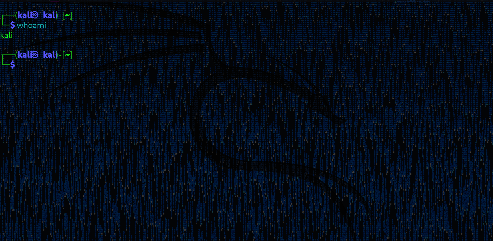
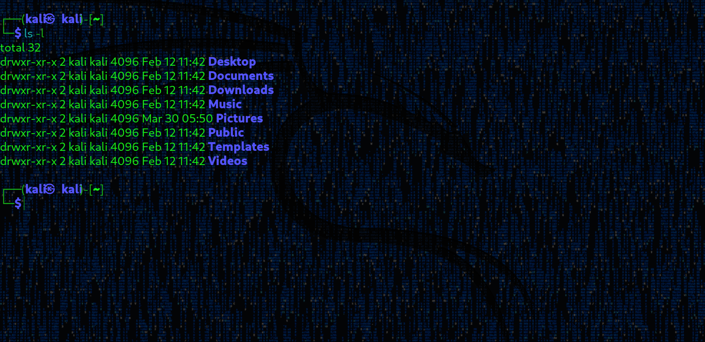
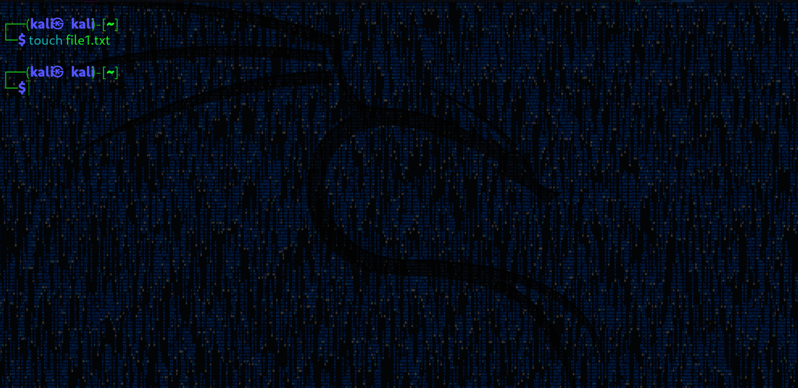
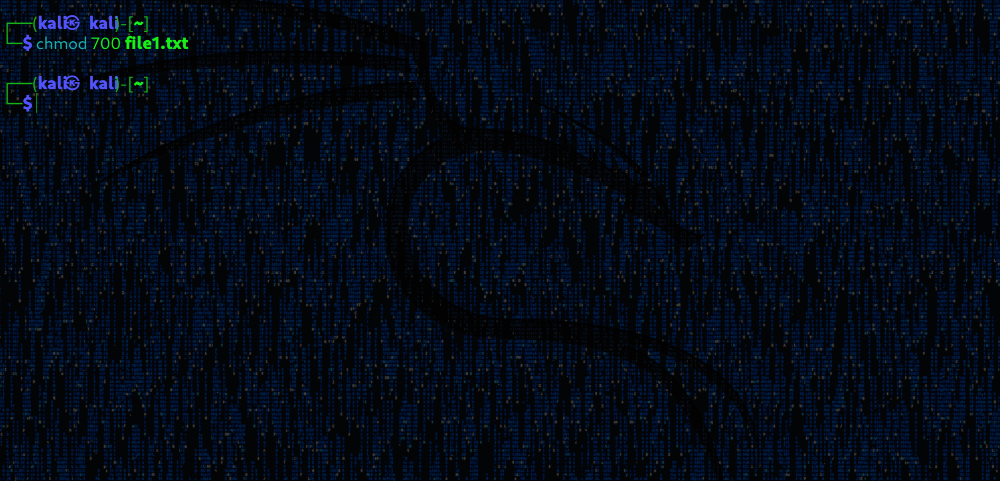

# 📦 Module 01 — Filesystem & Commands

This module covers the fundamentals of Linux system usage, focusing on filesystem structure, command-line navigation, file manipulation, permissions, and productivity shortcuts.

---

## 🎯 Objective

Build a strong foundation in Linux by mastering essential commands and understanding how the system is structured and operated through the terminal.

---

## 📚 Lessons Overview

### 📁 Introduction

Linux is a Unix-based operating system widely used in servers, cybersecurity, and development environments. It allows full control over the system through the terminal.

---

### 📁 Installation

Environment setup and initial configuration for using Linux.

#### Steps

1. Download Ubuntu (LTS)  
2. Install VirtualBox  
3. Create a virtual machine  
4. Attach the ISO file  
5. Configure RAM and disk  
6. Complete installation  

#### Post-installation

    sudo apt update
    sudo apt upgrade

---

### 📁 Terminal Basics

#### Commands

- `whoami`
- `hostname`
- `pwd`
- `clear`

#### Example

    whoami
    hostname
    pwd

---

### 📁 Navigation

#### Commands

- `pwd`
- `cd`
- `ls`

#### Example

    pwd
    cd /home
    ls -l

---

### 📁 File Manipulation

#### Commands

- `touch`
- `cp`
- `mv`
- `rm`
- `cat`
- `nano`
- `echo`
- `mkdir`

#### Example

    touch file.txt
    echo "hello" > file.txt
    cp file.txt copy.txt
    mv copy.txt newfile.txt

---

### 📁 Permissions

#### Commands

- `chmod`
- `ls -l`

#### Example

    ls -l
    chmod 700 file.txt

---

### 📁 Shortcuts & Productivity

#### Shortcuts

- `Ctrl + C`
- `Ctrl + Z`
- `Ctrl + L`
- `Ctrl + R`
- `!!`

---

### 📁 Filesystem Hierarchy Standard (FHS)

#### Key directories

- `/` → root  
- `/home` → user files  
- `/etc` → configs  
- `/var` → logs  
- `/tmp` → temporary  

---

## 📸 Visual Examples

Full gallery available in the [assets](../../assets/) directory.

---

## 🧠 Key Learnings

- Linux filesystem structure  
- Command-line navigation  
- File manipulation  
- Permission handling  
- Terminal productivity  

---

## 🚀 Outcome

After completing this module, you are able to:

- Navigate and manage files  
- Understand system structure  
- Execute essential commands  
- Work efficiently in the terminal  

---

## 📜 License

[MIT License](../../LICENSE)
